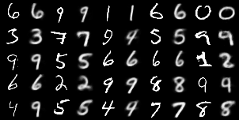
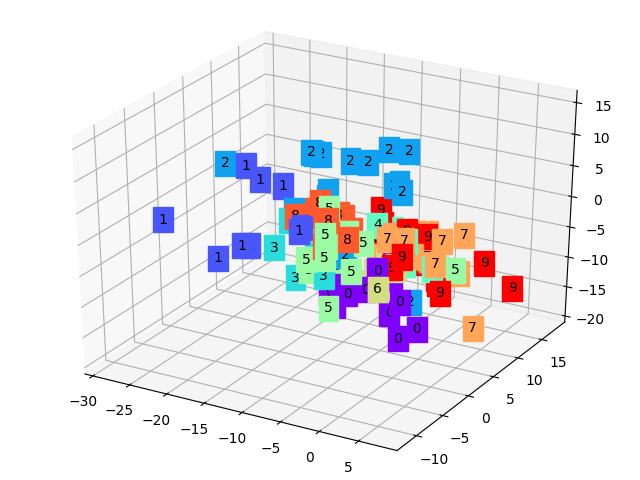
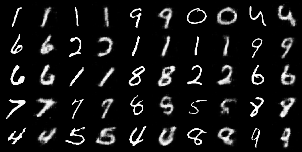
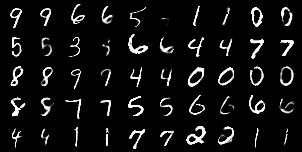

#### Generative Models

Here is a simple collection of common generative models:

- Vanilla Auto-Encoder
- CNN Auto-Encoder
- Variational Auto-Encoder
- Vanilla GAN (for reconstructing distribution and MNIST, respectively)

##### Comparation of Auto-Encoders

Below are the performance of auto-encoders after training on MNIST dataset 50 epochs. Note that the orignal input and model output images are shown alternately as columns.

###### Vanilla AE

###### CNN AE

###### Variational AE
 
